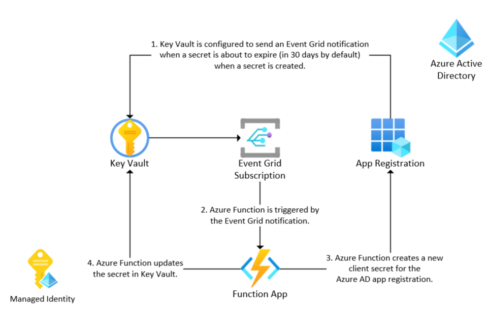

# keyvault-java

This repo demonstrates how to set up automatic [Azure AD app registration](https://learn.microsoft.com/en-us/azure/active-directory/develop/active-directory-how-applications-are-added) client secret rotation using [Azure Functions](https://learn.microsoft.com/en-us/azure/azure-functions/functions-reference-java?tabs=bash%2Cconsumption) (in Java) and [Key Vault](https://learn.microsoft.com/en-us/azure/key-vault/general/event-grid-overview) (with Event Grid notification when secrets are about to expire).



1.  Key Vault is configured to send an Event Grid notification when a secret is about to expire (in 30 days by default) when a secret is created.
1.  Azure Function is triggered by the Event Grid notification.
1.  Azure Function creates a new client secret for the Azure AD app registration.
1.  Azure Function updates the secret in Key Vault.

## Disclaimer

**THE SOFTWARE IS PROVIDED "AS IS", WITHOUT WARRANTY OF ANY KIND, EXPRESS OR IMPLIED, INCLUDING BUT NOT LIMITED TO THE WARRANTIES OF MERCHANTABILITY, FITNESS FOR A PARTICULAR PURPOSE AND NONINFRINGEMENT. IN NO EVENT SHALL THE AUTHORS OR COPYRIGHT HOLDERS BE LIABLE FOR ANY CLAIM, DAMAGES OR OTHER LIABILITY, WHETHER IN AN ACTION OF CONTRACT, TORT OR OTHERWISE, ARISING FROM, OUT OF OR IN CONNECTION WITH THE SOFTWARE OR THE USE OR OTHER DEALINGS IN THE SOFTWARE.**

## Prerequisites

- [Azure CLI](https://learn.microsoft.com/en-us/cli/azure/install-azure-cli)
- [Azure Bicep](https://learn.microsoft.com/en-us/azure/azure-resource-manager/bicep/install)
- [Java 11](https://www.oracle.com/java/technologies/javase-jdk11-downloads.html)
- Azure subscription & resource group

## Deployment

1.  Modify the `./infra/env/dev.parameters.json` file to match your environment.

1.  Run the following command to deploy the initial infrastructure to Azure.

```shell
az deployment group create -g rg-keyVaultJava-ussc-dev --template-file ./infra/init/main.bicep --parameters ./infra/env/dev.parameters.json
```

1.  Update the `./src/java/pom.xml` file to match your environment (specifically the `functionAppName`, `resourceGroup`, `appServicePlanName` and `region` keys)

1.  Build & deploy the Azure Function Java code.

```shell
cd src/java
mvn clean package
mvn azure-functions:deploy
```

1.  Deploy the Event Grid subscription now that an endpoint exists in Azure Functions.

```shell
cd ../..
az deployment group create -g rg-keyVaultJava-ussc-dev --template-file ./infra/subscription/main.bicep --parameters ./infra/env/dev.parameters.json
```

1.  Create a test App Registration to be managed by the Azure Function in Azure Active Directory. Take note of the `objectId` of the App Registration.

1.  Retrieve the **Object Id** of the Managed Identity.

```shell
az identity show -g rg-keyvaultJava-ussc-dev -n mi-keyVaultJava-ussc-dev --query principalId
```

1.  Run the following command to assign the Managed Identity ownership over a test app registration (the **id** is the objectId of the app registration, the **owner-object-id** is the objectId of the Managed Identity).

```shell
az ad app owner add --id a9425fd4-66c5-43a2-afb2-9135ec474e4a --owner-object-id 51819bcc-7865-4f6d-9f50-48ffbafe79a2
```

1.  Run the following command to assign the Managed Identity the `Application.ReadWrite.OwnedBy` permission on the Graph API so it can update the client secrets on any app registration it owns (the **spId** is the objectId of the Managed Identity). **NOTE: It is likely you will need an admin to do this for you.**

```shell
spId=51819bcc-7865-4f6d-9f50-48ffbafe79a2

graphResourceId=$(az ad sp list --display-name "Microsoft Graph" --query [0].id --out tsv)

appRoleId=$(az ad sp list --display-name "Microsoft Graph" --query "[0].appRoles[?value=='Application.ReadWrite.OwnedBy' && contains(allowedMemberTypes, 'Application')].id" --output tsv)

uri=https://graph.microsoft.com/v1.0/servicePrincipals/$spId/appRoleAssignments

body="{'principalId':'$spId','resourceId':'$graphResourceId','appRoleId':'$appRoleId'}"

az rest --method post --uri $uri --body $body --headers "Content-Type=application/json"
```

## Run the code

1.  Navigate to the test App Registration in the Azure portal. Copy the **objectId** of the App Registration.

1.  Click on **Certificates & secrets**.

1.  Click on **New client secret**.

1.  Enter a description and click **Add**.

1.  Copy the **id** & **value** of the secret.

1.  Navigate to the Key Vault in the Azure portal.

1.  Click on **Secrets**

1.  Click on **Generate/Import**

1.  Set the name of the secret to the **objectId** of the App Registration.

1.  Set the value of the secret to the **value** of the secret.

1.  Set the **Content Type** to the **id** of the secret (not of the App Registration, but of the secret itself).

1.  Set the **Expiration date** to a date in the near future (less than 30 days from now).

1.  Click **Create**.

1.  Wait a few minutes for Key Vault to send the notification to the Azure Function.

1.  Navigate back to the App Registration in the Azure portal.

1.  Click on **Certificates & secrets**.

1.  Notice that the secret has been replaced by a new one. Note the first 3 characters of the **Value** and the **Expires** value.

1.  Navigate back to the Key Vault in the Azure portal.

1.  Click on **Secrets**

1.  Click on the secret.

1.  Notice that a new secret version has been created. If you open it, you will see the new **secret value** and **expiration date** 1 year in the future.

## Links

- [Azure Key Vault](https://docs.microsoft.com/en-us/azure/key-vault/general/overview)
- [Azure Event Grid](https://docs.microsoft.com/en-us/azure/event-grid/overview)
- [Azure Functions](https://docs.microsoft.com/en-us/azure/azure-functions/functions-overview)
- [Azure Active Directory](https://docs.microsoft.com/en-us/azure/active-directory/fundamentals/active-directory-whatis)
- [Azure Managed Identities](https://docs.microsoft.com/en-us/azure/active-directory/managed-identities-azure-resources/overview)
